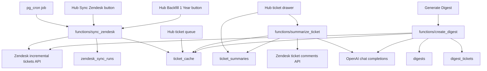
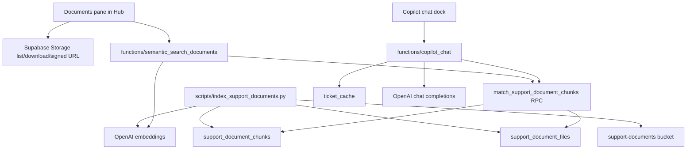
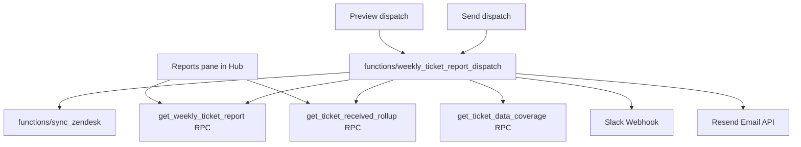

# Dependency Graph

This document maps the current project structure, runtime dependencies, and data flow.

## Scope

Current repo state reviewed on 2026-04-03.

Primary entrypoints:
- `src/pages/Index.tsx`
- `src/pages/Hub.tsx`
- `supabase/functions/*`

Primary runtime environments:
- Browser: public schedule and Support Hub UI
- Supabase: auth, Postgres, storage, Edge Functions
- External services: Google Sheets, Zendesk, OpenAI, Slack, Resend

## How To Read This Doc

Use the sections in this order:
1. top-level runtime graph for the big picture
2. feature ownership table for current file ownership
3. source-of-truth matrix to distinguish browser reads from privileged writes
4. domain-specific flow graphs for tickets, documents/copilot, and reporting
5. hotspot and impact sections before making changes

## Top-Level Runtime Graph

```mermaid
flowchart TD
  App["src/App.tsx"] --> Index["src/pages/Index.tsx"]
  App --> Hub["src/pages/Hub.tsx"]

  Index --> ScheduleData["src/lib/scheduleData.ts"]
  ScheduleData --> GoogleSheets["Google Sheets CSV feeds"]

  Hub --> SupabaseClient["src/integrations/supabase/client.ts"]
  Hub --> HubVideos["src/lib/hubVideos.ts"]
  Hub --> ArenaSites["src/lib/scheduleData.ts"]
  ArenaSites --> GoogleSheets

  SupabaseClient --> Auth["Supabase Auth"]
  SupabaseClient --> Postgres["Supabase Postgres"]
  SupabaseClient --> Storage["Supabase Storage"]

  Hub --> SyncZendeskFn["functions/sync_zendesk"]
  Hub --> SummarizeTicketFn["functions/summarize_ticket"]
  Hub --> CreateDigestFn["functions/create_digest"]
  Hub --> SlackFn["functions/send_to_slack"]
  Hub --> SemanticSearchFn["functions/semantic_search_documents"]
  Hub --> CopilotFn["functions/copilot_chat"]
  Hub --> AnalyticsFn["functions/hub_analytics"]
  Hub --> WeeklyDispatchFn["functions/weekly_ticket_report_dispatch"]

  SyncZendeskFn --> Zendesk["Zendesk API"]
  SummarizeTicketFn --> Zendesk
  CreateDigestFn --> Zendesk

  SummarizeTicketFn --> OpenAI["OpenAI API"]
  CreateDigestFn --> OpenAI
  SemanticSearchFn --> OpenAI
  CopilotFn --> OpenAI

  SlackFn --> Slack["Slack Webhook"]
  WeeklyDispatchFn --> Slack
  WeeklyDispatchFn --> Resend["Resend Email API"]
```

## Current Feature Ownership

| Area | Main frontend owner | Main backend owner | Primary data source |
| --- | --- | --- | --- |
| Public schedule | `src/pages/Index.tsx` | none | Google Sheets CSV |
| Hub auth/session | `src/pages/Hub.tsx` | `functions/_shared/auth.ts` | Supabase Auth |
| Ticket queue | `src/pages/Hub.tsx` | `functions/sync_zendesk` | `ticket_cache` |
| Ticket summary | `src/pages/Hub.tsx` | `functions/summarize_ticket` | `ticket_cache`, `ticket_summaries`, Zendesk |
| Digests | `src/pages/Hub.tsx` | `functions/create_digest` | `digests`, `digest_tickets`, Zendesk |
| Documents | `src/pages/Hub.tsx` | `functions/semantic_search_documents` | Storage, `support_document_files`, `support_document_chunks` |
| Videos | `src/components/hub/VideosPane.tsx` | none | static library in `src/lib/hubVideos.ts` |
| Reports | `src/pages/Hub.tsx` | `functions/weekly_ticket_report_dispatch` | SQL RPCs on `ticket_cache` |
| Copilot | `src/components/hub/CopilotChatDock.tsx` + `src/pages/Hub.tsx` | `functions/copilot_chat` | document chunks, `ticket_cache`, OpenAI |
| Analytics | `src/pages/Hub.tsx` | `functions/hub_analytics` | `hub_analytics_events` |

## Source-Of-Truth Matrix

| Domain | Browser reads from | Writes happen through | Source of truth | Notes |
| --- | --- | --- | --- | --- |
| Public schedule | Google Sheets CSV via `src/lib/scheduleData.ts` | none | Google Sheets | public page does not cache this in Supabase |
| Arena site coverage | Google Sheets CSV via `src/lib/scheduleData.ts` | none | Google Sheets | shown publicly in filtered form and in Hub table form |
| Hub auth | Supabase Auth session | browser auth actions + function auth helper | Supabase Auth | browser and functions both enforce `@virtuix.com` |
| Ticket queue | `ticket_cache` | `functions/sync_zendesk` | `ticket_cache` | current operational ticket table |
| Ticket summaries | `ticket_summaries` and mirrored `ticket_cache.summary_text` | `functions/summarize_ticket` | `ticket_summaries` | cache mirror exists for convenient queue reads |
| Digests | `digests` | `functions/create_digest` | `digests` | `digest_tickets` is linkage metadata |
| Sync observability | `zendesk_sync_runs` | `functions/sync_zendesk`, cron, dispatch flow | `zendesk_sync_runs` | also used to coordinate dispatch freshness |
| Documents library | Supabase Storage | storage upload process outside app | Storage bucket | browser lists and previews directly |
| Document semantic index | `support_document_files`, `support_document_chunks` | `scripts/index_support_documents.py` | chunk tables | required for semantic search and copilot grounding |
| Reports | SQL RPCs on `ticket_cache` | none directly; freshness depends on sync | RPC results over `ticket_cache` | reporting is derived, not independently stored |
| Videos | `src/lib/hubVideos.ts` | repo edits | static code data | no backend dependency |
| Analytics events | none in browser today | `functions/hub_analytics` | `hub_analytics_events` | best-effort event ingestion |

## Browser-Level Dependency Graph

```mermaid
flowchart TD
  Main["src/main.tsx"] --> App["src/App.tsx"]

  App --> PublicRoute["/ -> Index"]
  App --> HubRoute["/hub* -> Hub"]

  PublicRoute --> WeekCard["components/schedule/WeekCard.tsx"]
  PublicRoute --> ScheduleTable["components/schedule/ScheduleTable.tsx"]
  PublicRoute --> ArenaSitesTable["components/schedule/ArenaSitesTable.tsx"]
  PublicRoute --> ScheduleData["lib/scheduleData.ts"]

  HubRoute --> SideNav["inline side navigation in Hub.tsx"]
  HubRoute --> TicketTable["inline ticket table in Hub.tsx"]
  HubRoute --> TicketDrawer["inline drawer in Hub.tsx"]
  HubRoute --> DigestsPane["inline digests pane in Hub.tsx"]
  HubRoute --> DocumentsPane["inline documents pane in Hub.tsx"]
  HubRoute --> ReportsPane["inline reports pane in Hub.tsx"]
  HubRoute --> VideosPane["components/hub/VideosPane.tsx"]
  HubRoute --> CopilotDock["components/hub/CopilotChatDock.tsx"]
  HubRoute --> SupabaseClient["integrations/supabase/client.ts"]
```

## Ticket Data Flow

## Document and Copilot Data Flow

## Reporting and Dispatch Flow

## Database Dependency Summary

Current operational tables and RPCs used by the app:

| Object | Used by |
| --- | --- |
| `ticket_cache` | Hub tickets, summary generation, digest generation, reports, copilot |
| `ticket_summaries` | Ticket drawer summary cache |
| `digests` | Digests pane, Slack digest send |
| `digest_tickets` | Digest ticket linkage |
| `zendesk_sync_runs` | Sync status UI, cron/dispatch coordination |
| `support_document_files` | semantic search metadata |
| `support_document_chunks` | semantic search and copilot document grounding |
| `hub_analytics_events` | product analytics ingestion |
| `get_weekly_ticket_report(...)` | reports pane, weekly dispatch |
| `get_ticket_received_rollup(...)` | reports pane, weekly dispatch |
| `get_ticket_data_coverage()` | weekly dispatch |
| `match_support_document_chunks(...)` | documents semantic search, copilot |

## Legacy And Non-Authoritative Paths

These exist in the repo but are not the main current operational path:

- `supabase/functions/zendesk-sync/index.ts`: older Zendesk ingestion function; current Hub path uses `functions/sync_zendesk`.
- `public.zendesk_tickets`: older ticket store; current Hub path uses `public.ticket_cache`.
- `time_off_requests` in `src/integrations/supabase/types.ts`: legacy schema still present in generated types but not in the active UI flow.
- `src/components/schedule/NoSupportList.tsx`: not on an active route; the current active site coverage UI is `ArenaSitesTable`.
- `src/integrations/supabase/types.ts`: partially stale relative to the active schema, so it should not be treated as the complete architecture source of truth.

## High-Coupling Hotspots

### 1. `src/pages/Hub.tsx`

This file currently owns:
- auth bootstrap
- route/view switching
- most browser-side Supabase reads
- all Edge Function invocation wrappers
- ticket selection and drawer state
- digests, documents, reports, sync, download, semantic search, and dispatch logic
- large chunks of view rendering

Impact:
- high change risk
- hard to test in slices
- difficult to reuse or reason about feature boundaries

### 2. Shared function auth pattern

All current Edge Functions rely on:
- `verify_jwt = false` in `supabase/config.toml`
- manual request auth in `functions/_shared/auth.ts`

Impact:
- auth behavior is centralized and consistent
- function correctness depends on each function calling the helper correctly

### 3. Generated Supabase types are stale

`src/integrations/supabase/types.ts` does not represent the full current schema.

Impact:
- frontend code falls back to local manual types
- schema drift is easier to miss

### 4. Legacy Zendesk path still exists

Older pipeline still present:
- `functions/zendesk-sync`
- `zendesk_tickets`

Current Hub path uses:
- `functions/sync_zendesk`
- `ticket_cache`

Impact:
- easy to confuse old and current ingestion paths

## Current Practical Dependency Rules

- If `ticket_cache` changes, Hub tickets, summaries, digests, reports, and copilot can all move.
- If `zendesk_sync_runs` changes, sync status UI, cron coordination, and weekly dispatch can move.
- If `support_document_chunks` or `match_support_document_chunks` changes, both semantic search and copilot grounding can move.
- If `functions/_shared/auth.ts` changes, every protected Edge Function can move.
- If `src/pages/Hub.tsx` changes, most internal product behavior can move.

## Change Impact Checklist

If you change one of these areas, inspect the listed dependents before merging:

| If you change | Also inspect |
| --- | --- |
| `src/pages/Hub.tsx` | all Hub views, auth flow, sync controls, documents, reports, copilot |
| `ticket_cache` schema | queue reads, summaries, digests, reports, copilot, dispatch |
| `zendesk_sync_runs` schema | sync status UI, cron locking, dispatch wait logic |
| `support_document_chunks` or `match_support_document_chunks(...)` | documents semantic search, copilot citations, indexing script |
| `functions/_shared/auth.ts` | every Edge Function and every browser-triggered function call |
| `functions/sync_zendesk` payload contract | Hub sync buttons, backfill flow, weekly dispatch |
| `functions/send_to_slack` payload contract | ticket drawer Slack action, digest Slack action |
| `src/integrations/supabase/types.ts` regeneration | app-level types in `src/types/support.ts` and any raw DB row assumptions |

## Suggested Maintenance Rule

When a new feature is added, update this doc in three places:
- feature ownership table
- relevant runtime graph
- hotspot notes if the new work increases or reduces coupling
